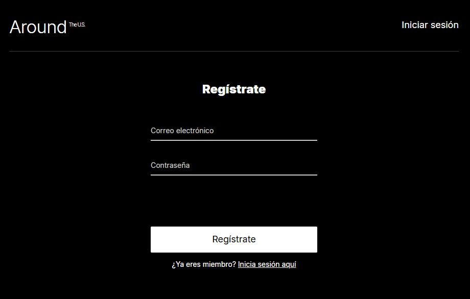
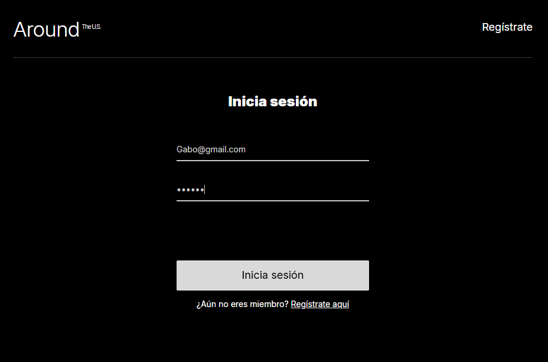
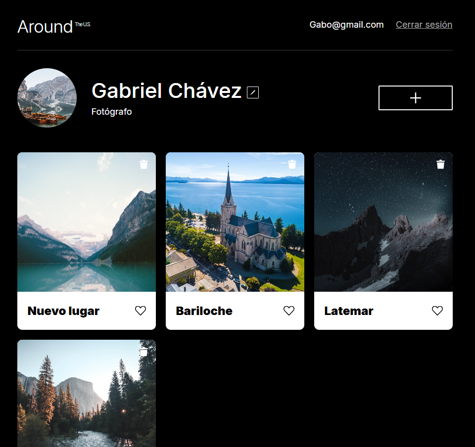

# Around The U.S. — Authentication

## Description
Around The U.S. is an interactive web application that allows users to share and explore photos of places across the United States. This version of the project implements a full user authentication system, including registration, login, and protected routes.

Users must register or log in to access the main content. Once authenticated, they can view and manage photo cards, edit their profile, and log out securely.

## Features
- User registration with success/error feedback modal (InfoTooltip)
- User login with JWT token storage in localStorage
- Token validation on page load — users stay logged in across sessions
- Protected main route (`/`) — unauthorized users are redirected to `/signin`
- Dynamic header: shows email and logout button when logged in
- Responsive design 
- Card gallery with like and delete functionality
- Profile and avatar editing

## Screenshots

### Sign In

### Sign Up

### Main Page (Logged In)

## Technologies & Techniques
- **React** — functional components and hooks (`useState`, `useEffect`)
- **React Router v5** — client-side routing with `Switch`, `Route`, `Redirect`
- **JWT Authentication** — token stored in `localStorage`, validated on mount
- **Vite** — project bundler and development server
- **CSS** — BEM methodology, responsive design with media queries
- **REST API** — connected to TripleTen's backend for auth and Around API for cards
- **GitHub Pages** — deployment via `gh-pages`

## Live Demo
[https://gaboobga.github.io/web_project_around_auth/](https://gaboobga.github.io/web_project_around_auth/)